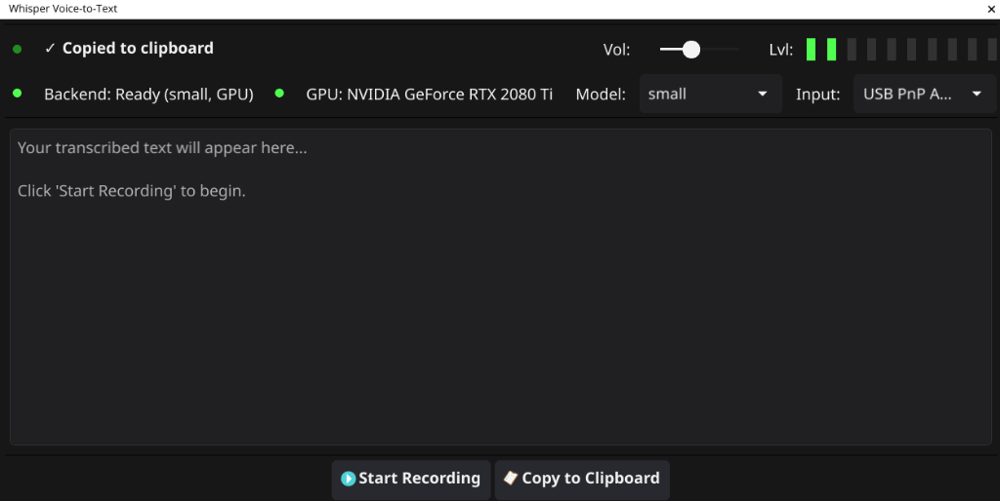

# whisper-gui



A simple Go GUI for OpenAI's Whisper model that runs **100% locally**. 

## Features & Privacy
* **Fully Local & Private:** Unlike cloud-based transcription services, your audio data never leaves your machine. The neural networks mathematical processing happens entirely on your own CPU/GPU hardware.
* **Offline Capable:** After downloading the model weights once, you do not need an internet connection to use the application.
* **Responsive GUI:** Dynamically resizes to fit your workspace, packing all necessary controls into a tight profile.

## System Requirements

While the baseline requirements are low, OpenAI's Whisper models demand system RAM and VRAM scaling up with the model size you select.

| Model Size | Parameters | English-only | Multilingual | VRAM/RAM Required | Relative Speed |
|------------|------------|--------------|--------------|-------------------|----------------|
| **tiny**   | 39 M       | tiny.en      | tiny         | ~1 GB             | ~32x           |
| **base**   | 74 M       | base.en      | base         | ~1 GB             | ~16x           |
| **small**  | 244 M      | small.en     | small        | ~2 GB             | ~6x            |
| **medium** | 769 M      | medium.en    | medium       | ~5 GB             | ~2x            |
| **large**  | 1550 M     | N/A          | large        | ~10 GB            | 1x             |

### Dependencies

1.  **Python 3.8+**
2.  **Go 1.20+**
3.  **PortAudio** (C libraries required for microphone recording)
    *   Ubuntu/Debian/Mint: `sudo apt-get install portaudio19-dev`
    *   Arch Linux/Manjaro: `sudo pacman -S portaudio`
    *   Fedora/RHEL: `sudo dnf install portaudio-devel`

## Installation

1.  **Create a Python Virtual Environment:**
    ```bash
    python3 -m venv .venv
    ```

2.  **Activate the Virtual Environment and Install Dependencies:**
    ```bash
    source .venv/bin/activate
    pip install -r requirements.txt
    ```
    *Note: If you want GPU acceleration, ensure you have the correct version of PyTorch installed for your system (e.g., CUDA) before running the above command.*

3.  **Compile the Application:**
    ```bash
    go build -o whisper-gui
    ```

4.  **Run the Compiled Application:**
    ```bash
    ./whisper-gui
    ```
    *(You can now move this binary anywhere on your system. It will automatically attempt to locate the original `.venv` directory based on where it was compiled.)*

## Alternative Execution Methods

### Running directly with Go
During development, you can run the application directly without compiling a final binary:
```bash
go run main.go
```

### Advanced Usage (Custom Python Environments)
If you move the compiled binary out of the project directory (e.g., to your `~/bin`), the application will no longer be able to automatically find the `.venv` directory for its Python dependencies if the original project path changes.
You can use the `PYTHON_ENV` environment variable to explicitly point the binary to your environment.

**Point to the `.venv` directory:**
```bash
PYTHON_ENV=/path/to/whisper-gui/.venv whisper-gui
```

**Point directly to a python executable:**
```bash
PYTHON_ENV=/usr/local/bin/python3.10 whisper-gui
```

*Tip: You can add an alias in your `~/.bashrc` or `~/.zshrc` to make this easier:*
```bash
alias whisper-gui="PYTHON_ENV=/path/to/whisper-gui/.venv whisper-gui"
```
